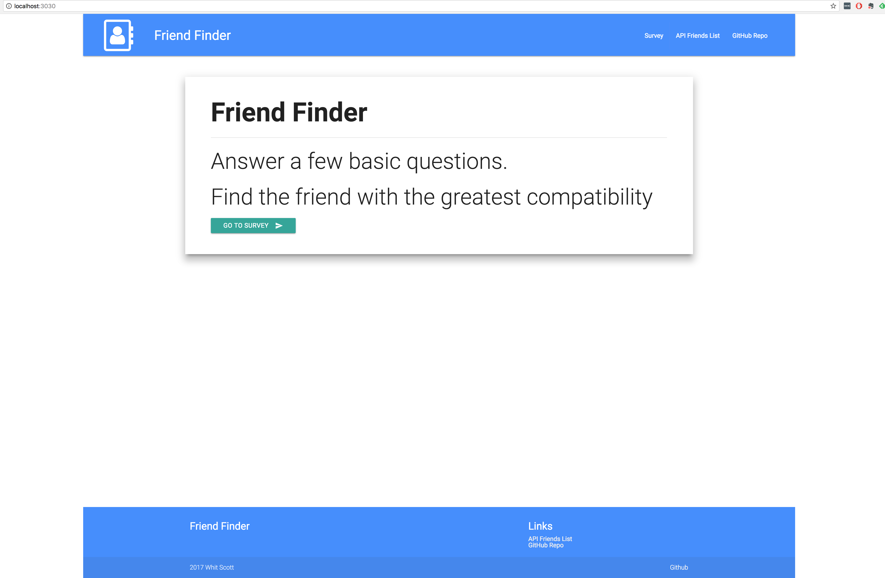
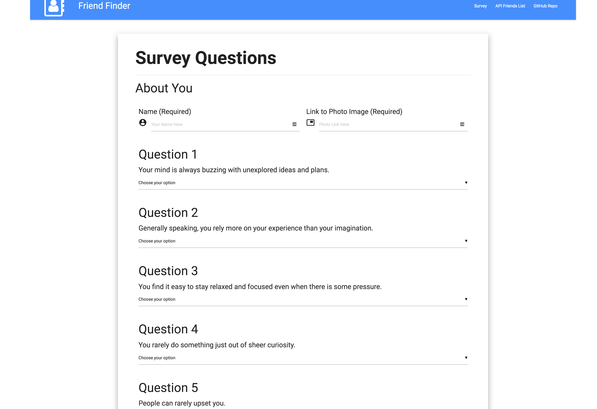
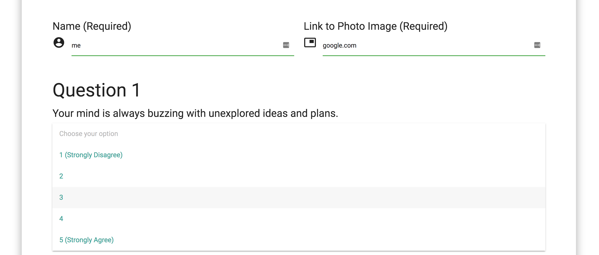
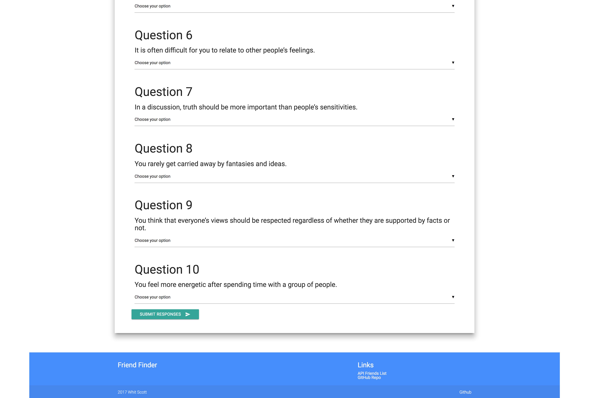
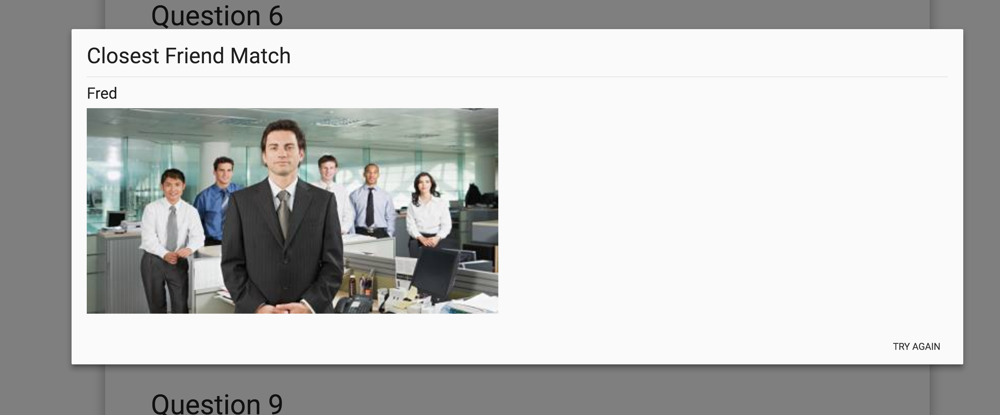

# Friend-finder

## Instructions

Use package.json to set up your npm installs. Set your export PORT and run server.js in your CLI. 

Go to localhost:[SET PORT] in your browser to see the homepage:

Click the Go to survey button to begin and you will be taken to the survey page:

Fill out your info and answer the survey questions:

When complete, click the Submit button at the bottom of the survey:

Based on your responses you will be matched with a new friend:

